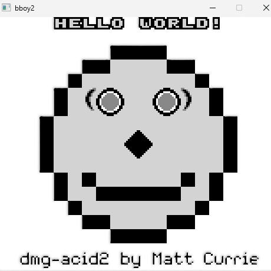

# bboy2

After I wrote my first emulator in C# I immediately wanted to try to write one in C++. This emulator uses function pointers and a lookup table for the CPU instructions, and memory paging for the MMU. It supports joypad input and loading ROMs via drag-and-drop.



## Building and Running

### Clone the repository

```sh
git clone https://github.com/qalibr/bboy2.git
cd bboy2
```

### Build the project

Xmake requires the user to choose which mode, *debug or release*, they are in (default is release). After selecting a mode, whenever you build and run the program it will be executed in whatever mode you chose.

To change modes, use either of these in the CLI.

```sh
xmake f -m debug
```

```sh
xmake f -m release
```

Then, build:

```sh
xmake build
```

\**Look for '.debug/.release' in the terminal output to know which mode you are in.*

### Run the emulator

```sh
xmake run
```

You can also supply an argument to load a rom instantly:

```sh
xmake run bboy2 <path-to-your-rom>
```

Example:

```sh
xmake run bboy2 roms/dmg-acid2.gb
```

\**Xmake runs in the project directory and expects to find the custom font there (assets/font/...).*

## Keymap

| Action        | Key           |
| ------------- | ------------- |
| D-Pad Up      | `W`           |
| D-Pad Down    | `S`           |
| D-Pad Left    | `A`           |
| D-Pad Right   | `D`           |
| A Button      | `E`           |
| B Button      | `R`           |
| Start         | `F`           |
| Select        | `Z`           |

## Resoures

<https://gbdev.io/pandocs/>

<https://gbdev.io/gb-opcodes/optables/>

<https://github.com/gbdev/awesome-gbdev>

### Testing

<https://github.com/robert/gameboy-doctor>

<https://github.com/retrio/gb-test-roms>

<https://github.com/mattcurrie/dmg-acid2>

## Emulators

<https://github.com/qalibr/BomberBoy/tree/main>

## Libraries

<https://github.com/raysan5/raylib/releases>
